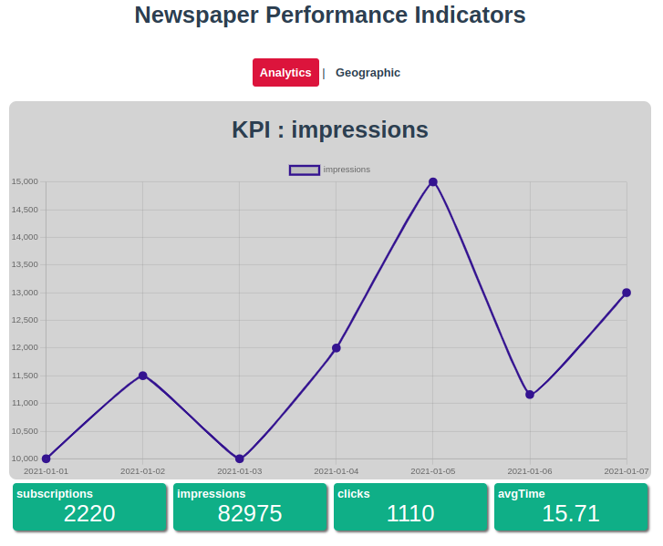

[![Issues][issues-shield]][issues-url]
[![LinkedIn][linkedin-shield]][linkedin-url]

<!-- PROJECT LOGO -->
<br />
<div align="center">
  <h3 align="center">Analytics - Vue.js</h3>
  
  <p align="center">Project created for <strong>Start2Impact</strong> course: <em>Vue.js - Advanced</em></p>
</div>

### Built With

* [HTML 5](https://developer.mozilla.org/en-US/docs/Glossary/HTML)
* [CSS 3](https://developer.mozilla.org/en-US/docs/Web/CSS)
* [Javascript](https://developer.mozilla.org/en-US/docs/Web/JavaScript?retiredLocale=it)
* [Vue.js](https://vuejs.org/)
* [Webpack 5](https://webpack.js.org/blog/2020-10-10-webpack-5-release/)
* [Vue-router](https://router.vuejs.org/)
* [Pinia](https://pinia.vuejs.org/)

<!-- TABLE OF CONTENTS -->
<details open="open">
  <summary>Table of Contents</summary>
  <ol>
    <li><a href="#getting-started">Getting Started</a></li>
    <li><a href="#usage">Usage</a></li>
    <li><a href="#contact">Contact</a></li>
  </ol>
</details>

<!-- GETTING STARTED -->
## Getting Started

1. Clone the repo

```sh
git clone git@github.com:matteorazzanelli/analytics-vue.git
```

2. Project setup
```
npm install
```

3. Add your GOOGLE API KEY to .env file
```
VUE_APP_GOOGLE_MAPS_API_KEY=<YOUR_KEY>
```

4. Compiles and hot-reloads for development
```
npm run serve
```

5. Run json-server for upload local database
```
npx json-server --watch data/geo_marker.json
```

6. Go to http://localhost:8080

<!-- USAGE -->
## Usage

- The first view shows to analytics
- Press any block to see the related matrics accross time
- Every 2 seconds impressions increments of 5
- The second view is a static google map that shows where the most traffic comes from
- The locations are stored statically in the local database using json-server

<!-- CONTACT -->
## Link & Contact

Matteo Razzanelli - matteo.razzanelli89@gmail.it

Start2impact personal page - https://talent.start2impact.it/profile/matteo-razzanelli

Project Repository: [Analytics App](https://github.com/matteorazzanelli/analytics-vue)

Project Website:  [Analytics App - Firebase](https://analytics-vuejs-app.web.app/)

<!-- MARKDOWN LINKS & IMAGES -->
[issues-shield]: https://img.shields.io/github/issues/matteorazzanelli/analytics-vue/repo.svg?style=for-the-badge
[issues-url]: https://github.com/matteorazzanelli/analytics-vue/issues
[linkedin-shield]: https://img.shields.io/badge/-LinkedIn-black.svg?style=for-the-badge&logo=linkedin&colorB=555
[linkedin-url]: https://www.linkedin.com/in/matteo-razzanelli/